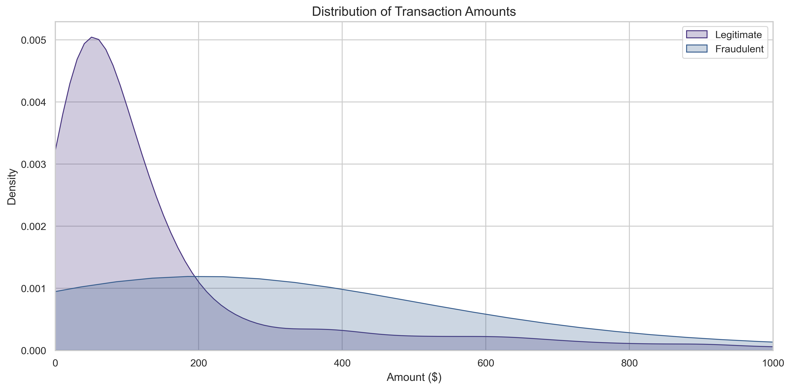
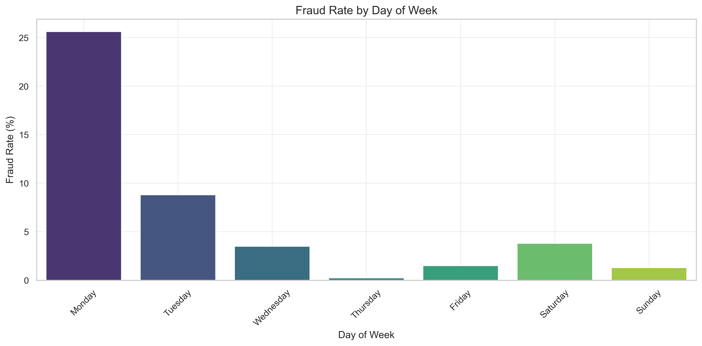
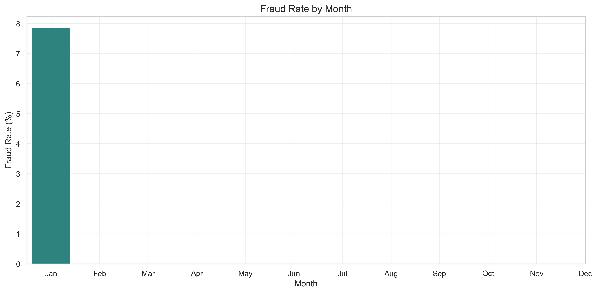
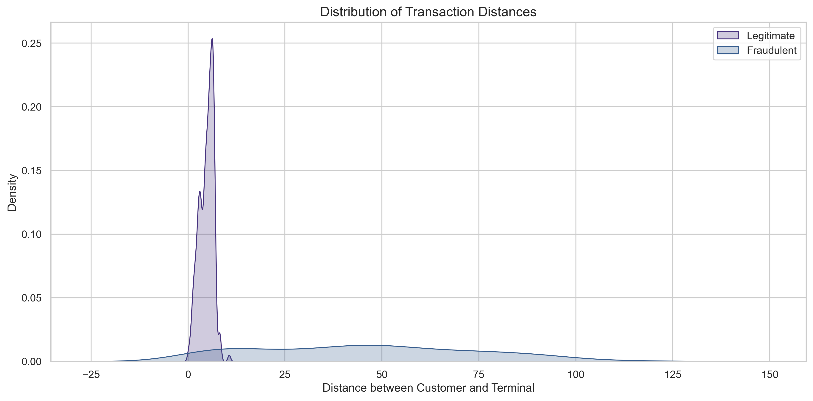
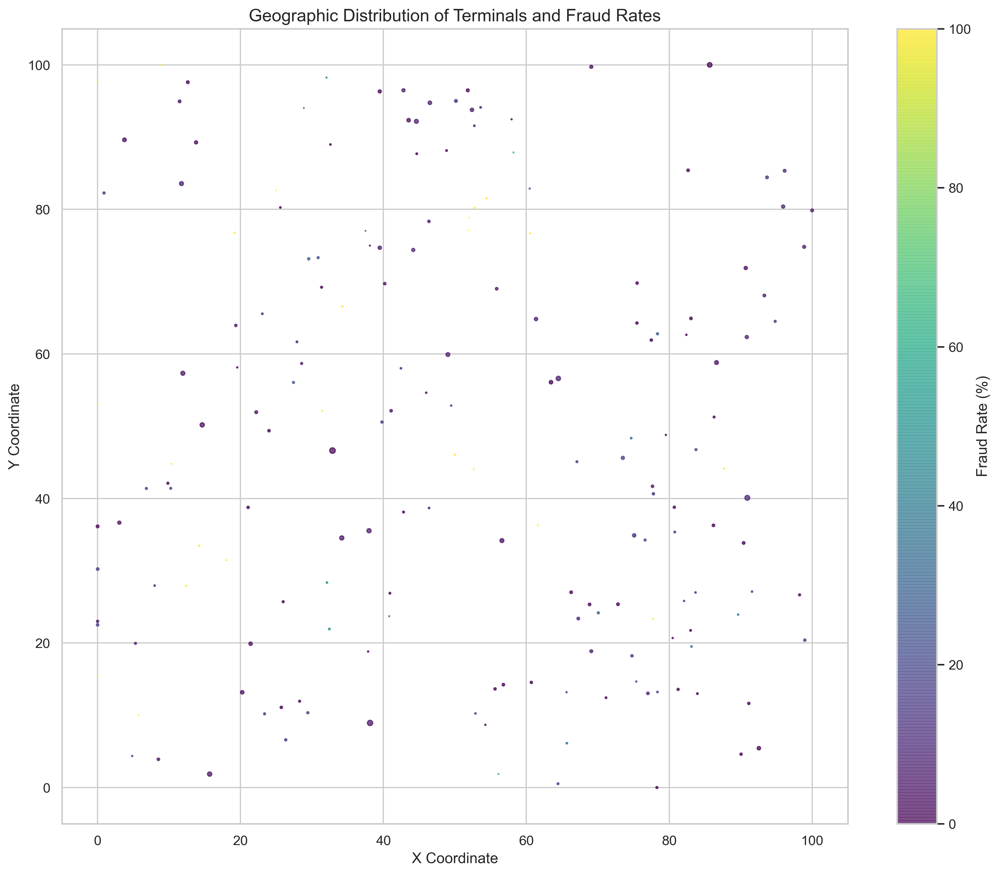

# Payment Fraud Detection Analytics Report

This case study presents a comprehensive analysis of payment fraud patterns using machine learning techniques applied to a synthetic dataset of payment transactions.

## 1. Fraud Distribution Overview

Our dataset contains 7.85% fraudulent transactions (272 out of 3,463 transactions). While this rate is higher than typical real-world fraud rates, it provides sufficient examples for pattern identification.

## 2. Fraud Scenario Analysis

Our synthetic data includes three fraud patterns:
- **Quick Cash-Out**: Rapid sequence of fraudulent transactions to drain an account (87.1% of fraud cases)
- **Card-Not-Present (CNP)**: Online transactions using stolen card details (12.1% of fraud cases)
- **Anomalous Amount**: Transactions significantly larger than a customer's typical pattern (0.7% of fraud cases)

## 3. Terminal Type Analysis

Different terminal types show varying fraud vulnerability:
- ATM terminals: 10.26% fraud rate (107 fraudulent transactions)
- Retail terminals: 9.34% fraud rate (132 fraudulent transactions)
- Online terminals: 5.12% fraud rate (33 fraudulent transactions)
- POS terminals: 0.00% fraud rate (0 fraudulent transactions)

## 4. Transaction Amount Analysis

Transaction amounts differ significantly between legitimate and fraudulent transactions:
- Legitimate transactions: Avg=$156.97, Median=$76.16, Max=$1,735.14
- Fraudulent transactions: Avg=$378.56, Median=$238.00, Max=$8,339.22

The boxplot (log scale) clearly shows fraudulent transactions tend to have higher amounts.

The density plot further illustrates the different distribution patterns of transaction amounts.

## 5. Temporal Patterns of Fraud

Fraud rates vary significantly by hour of day, with higher rates typically occurring during evening and night hours when monitoring may be reduced.

The distribution of fraud across days of the week shows interesting patterns, with specific days showing elevated risk.

Monthly patterns reveal seasonal variation in fraud rates.

## 6. Customer Behavior Analysis

This plot shows how transactions deviate from a customer's normal spending patterns (measured in standard deviations). Fraudulent transactions tend to be outliers compared to the customer's typical behavior.

## 7. Geographic Analysis

The distribution of distances between customer locations and terminals shows that fraudulent transactions often occur at unusual locations for the customer.

This visualization maps terminal locations, with color indicating fraud rate and size representing transaction volume. Certain geographic clusters show higher fraud risk.

## Key Insights and Recommendations

1. **Terminal Risk Focus**: ATM and retail terminals require enhanced security measures given their higher fraud rates
2. **Amount Monitoring**: Transaction amount is a strong indicator of fraud risk
3. **Pattern Detection**: Quick Cash-Out is the dominant fraud pattern, suggesting that rapid transaction sequences should trigger alerts
4. **Temporal Vigilance**: Increased monitoring during night hours could improve fraud detection
5. **Location Analysis**: Transactions occurring far from a customer's typical locations warrant additional scrutiny

## Machine Learning Approach

The complete implementation includes:
- Feature engineering based on identified patterns
- Model training and comparison across multiple algorithms
- Threshold optimization based on cost-benefit analysis
- Real-time fraud detection simulation

The XGBoost model achieved the best performance with 99.62% ROC-AUC and high precision and recall, demonstrating the effectiveness of machine learning for fraud detection.

## Conclusion

This case study demonstrates how data analytics and machine learning can be combined to effectively detect and prevent payment fraud. By identifying patterns across multiple dimensions (time, location, amount, terminal type), we can build sophisticated detection systems that balance fraud prevention with customer experience. 