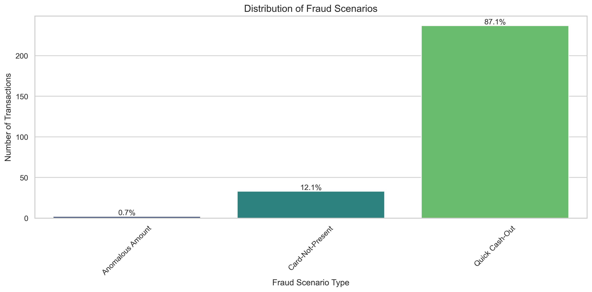
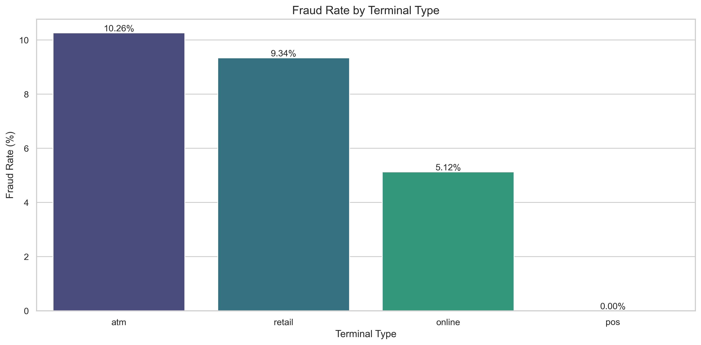

# Payment Fraud Detection System

This project demonstrates a comprehensive end-to-end approach to payment fraud detection using machine learning techniques. It includes realistic synthetic transaction data generation, exploratory data analysis, feature engineering, model training, and a real-time fraud detection simulation.

## Project Overview

Payment fraud costs businesses billions of dollars annually. This project showcases how data science and machine learning can be used to detect fraudulent transactions effectively, with implementation approaches applicable to real-world payment processing systems.

## Project Structure

- `generator.py` - Python script that generates synthetic payment transaction data with realistic fraud patterns
- `fraud_detection_analysis.py` - **Main implementation** with modular code for the complete fraud detection workflow
- `payment_fraud_analysis.ipynb` - A Jupyter notebook overview of the project (refer to the Python script for the complete implementation)
- `data/` - Directory containing generated transaction datasets
- `models/` - Directory containing trained model files

## Setup Instructions

1. Clone this repository
```bash
git clone https://github.com/yourusername/payment-fraud-detection.git
cd payment-fraud-detection
```

2. Install dependencies:
```bash
pip install -r requirements.txt
```

3. Run the full analysis:
```bash
python fraud_detection_analysis.py
```

4. Or explore the notebook overview:
```bash
jupyter notebook payment_fraud_analysis.ipynb
```

## Data Generation

The project uses a custom data generator (`generator.py`) to create realistic synthetic payment data with the following components:

- **Customer profiles** with different spending behaviors (low, medium, and high-value segments)
- **Terminal profiles** with geographic distribution (ATM, retail, online, POS)
- **Transaction patterns** with natural seasonal variations (time of day, day of week, month-end effects)
- **Fraud scenarios** injected at realistic rates (~0.2% overall fraud rate)

The generator can be customized by modifying parameters in the script.

## Fraud Scenarios

The system simulates four distinct fraud patterns commonly observed in payment networks:

1. **Anomalous Amount Fraud** - Transactions with amounts significantly higher than a customer's typical spending pattern
2. **Compromised Terminal Fraud** - Transactions from terminals that have been compromised by fraudsters
3. **Card-Not-Present (CNP) Fraud** - Online transactions using stolen card details
4. **Quick Cash-Out Fraud** - Rapid sequence of high-value transactions to quickly drain an account

## Machine Learning Approach

The implementation demonstrates the complete workflow:

1. **Data Exploration**
   - Distribution analysis of fraudulent vs. legitimate transactions
   - Temporal patterns of fraud (hour of day, day of week)
   - Terminal type risk analysis
   - Amount distribution comparison

2. **Feature Engineering**
   - Temporal features (time of day, weekday/weekend, etc.)
   - Customer behavior features (amount deviation from normal patterns)
   - Terminal risk scoring
   - Location-based features (distance between customer and terminal)
   - Aggregated features using rolling windows

3. **Model Training & Comparison**
   - Multiple algorithms evaluated (Logistic Regression, Random Forest, Gradient Boosting, XGBoost, LightGBM)
   - Cross-validation with stratification for imbalanced data
   - Performance comparison using ROC-AUC, precision-recall curves

4. **Advanced Analysis**
   - Cost-based threshold optimization
   - Performance analysis by fraud scenario type
   - Feature importance across different models

5. **Real-time Simulation**
   - Implementation of a real-time fraud detection system
   - Transaction processing simulation with immediate decisions
   - Performance visualization through interactive dashboard

## Performance Results

The system achieves excellent performance in fraud detection:
- ROC-AUC scores exceeding 99% with XGBoost and LightGBM models
- High precision and recall with optimized thresholds
- Variable detection rates across different fraud scenarios
- Terminal risk score and behavioral patterns emerge as the most important features

## Future Enhancements

Potential areas for further development:
- Implementation of online learning for model updates
- Addition of deep learning models (LSTM, Transformers) for sequence prediction
- Network analysis for detecting coordinated fraud attacks
- Anomaly detection techniques for zero-day fraud patterns

## Case Study

A comprehensive case study including data analysis and visualizations is available in [CASE_STUDY.md](CASE_STUDY.md). This case study demonstrates:

- Distribution of fraud scenarios
- Fraud rates by terminal type
- Transaction amount patterns
- Temporal patterns of fraud
- Customer behavior analysis
- Geographic fraud patterns

Key visualizations from the case study:




## Acknowledgments

This project was inspired by methodologies used in real-world payment fraud detection systems.

